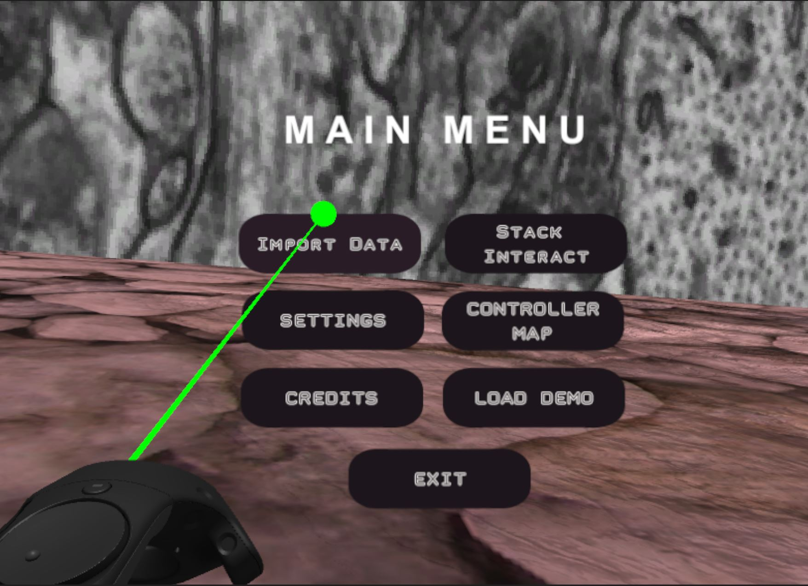
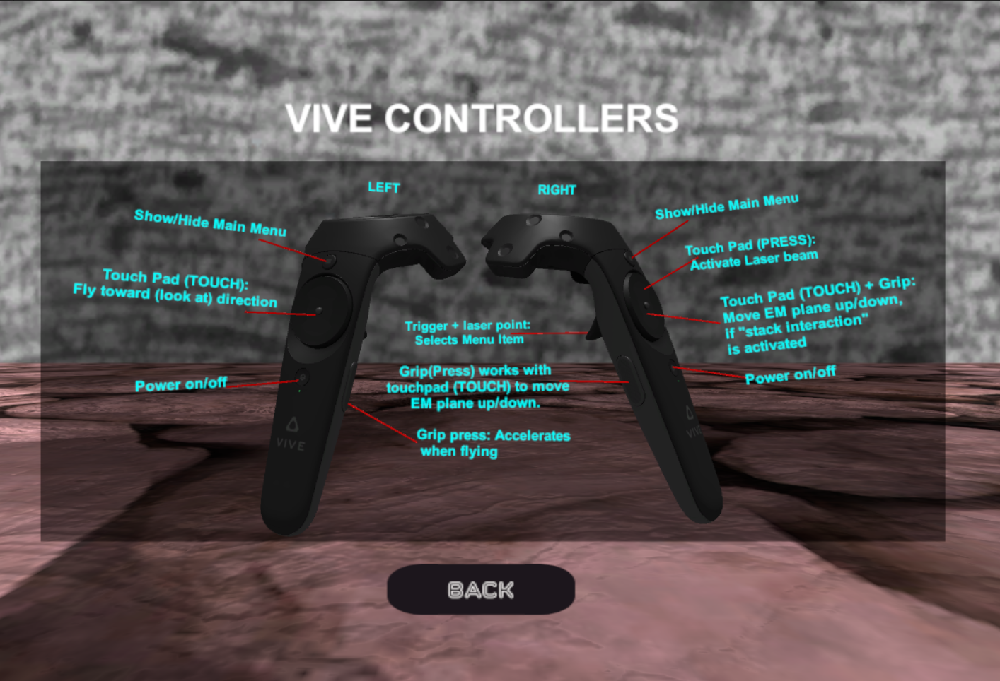

# VRDataInteract

VR Data Interact is a virtual reality software application that was developed using the Unity game engine **(V5.6.3f1)** with the support of SteamVR and VRTK assets libraries (Unity plugins). It allows the end user to import 3D models in an OBJ format. Two of its main features are the Stack Interact menu and the Object Interact menu. The former is customized for electron microscopy z stacks that corresponds with the reconstructed 3D models (targeted for import in VR). This features allows neuroscientists to proofread their models, as well as conduct explorative analysis by correlating the imported 3D model with its surrounding structures in the corresponding 2D EM slice.
The application is equipped with a demo model that includes 4 cellular/intracellular structures: a Glia, axons, dendrites, and glycogen granules.

The repository contians relatively large files (~2GB). Therefore, git lfs is necessary to have. Installation instructions can be found [here](https://git-lfs.github.com/). 

To clone:

$ get lfs clone https://github.com/daniJb/VRDataInteract.git

### Installation:
VRDataInteract is a Windows platform application. To install and run; few prerequisites need to be met (please refer to the [wiki](https://github.com/daniJb/VRDataInteract/wiki) for more information). Once all requirements are met, double mouse click on "VRDataInteract.exe" for application launch. Note that you need to have your HTC vive running and connected properly along with its both controllers beforehand.

To execute the demo files, refer to the vive-controller mappings below + main menu screenshot (Fig.1,Fig.2). Using the **RIGHT** controller (you can identify the right controller as the one that shoots a laser beam, the left controller does not), press the menu button for the main menu to appear, then laser-point on "Load Demo" by pressing on the **touchpad**, and then select it by using the **trigger** switch on the vive controller. Loading the demo will take some time depending on your PC specs.

Figure 1: Main Menu

Figure 2: Vive Controllers Mappings

In order to close the main menu, you can press the menu button again on your vive controller. Upon successful load, the demo will look like the following:

![Figure 3: Demo Model] Figure 3 here.

in order to interact with the stack, you need to launch the main menu again and select **Stack Interact** (by vive touchpad press + trigger click). This will launch the Stack Interact menu. Just laser point on the checkbox labeled **“Touchpad Scroll”** using vive **touchpad** press, and then select it with the **trigger** switch. The checkbox should appear checked as in the following screenshot:

![Figure 4: Stack Interact checkbox] Figure 4 here.

Now exit the menu by pressing on the vive menu button.

To move the “EM plane” up and down through the 3D model, you need to **hold press** on any of the two **grip** buttons on the sides of the vive controller, and then simply **touch** (not a clickable press) on the vive touchpad where the upper part of the circular touchpad moves the EM plane up, and the bottom part moves the EM plane down.

